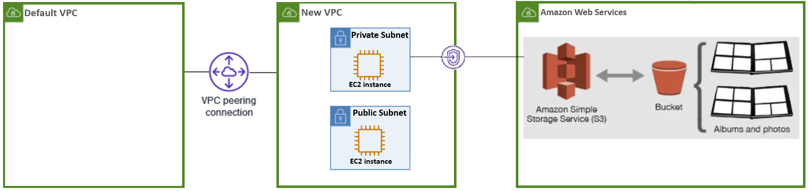

## Introduction:
The main steps on this guide are for establishing a **VPC Peering** and creating a **VPC endpoint** for **S3 Bucket Storage**. \
It includes other steps just for practice *or* as pre-requisites for the main steps.

## AWS Architecture Diagram :
 <br/>

## Script Steps:
> Before running a script:  ``` $ ./example-script.sh ``` , \
give it permission to execute:  ``` $ chmod +x example-script.sh ```

> The *destoy-script* is meant for deleting all that we created, with the help of a *.conf* file that stores all temporary variables (ID, ARN).

1. Create a new **VPC**.
2. Establish **VPC Peering**:
    - Place your *default **VPC** ID* in your *config.conf* file. \
    ``` VPC_ID_DEFAULT="vpc-xxxxxxxx" ```
    - Create a **VPC peering** connection between the *default **VPC*** and the *new **VPC***.
    - Ensure the peering connection status is *active*.
3. TODO: Launch **EC2 Instances**:
    -   Create a **private subnet** within the *new **VPC*** for the first **EC2 instance**.
    -   Create a **public subnet** within the *new **VPC*** for the second **EC2 instance**.
    -   Launch an **EC2 instance** in the **private subnet**.
    -   Launch another **EC2 instance** in the **public subnet**.
    -   *SSH* from the *public **EC2 instance** to the *private **EC2 instance*** using the *public IP* or *DNS*.
4. TODO: Create an **S3 Bucket**:
    -   Create an **S3 bucket**.
5. TODO: **VPC Endpoint** for **S3**:
    -   Create a VPC endpoint for S3 in the private subnet.
    -   Update the route tables for the private subnet to route S3 traffic through the VPC endpoint.
    > Don’t create a nat gateway, the private subnet should only reach s3.
6. TODO: Upload File to **S3**:
    -   From the EC2 instance in the private subnet, use the AWS CLI to attempt to upload a file to the S3 bucket.
