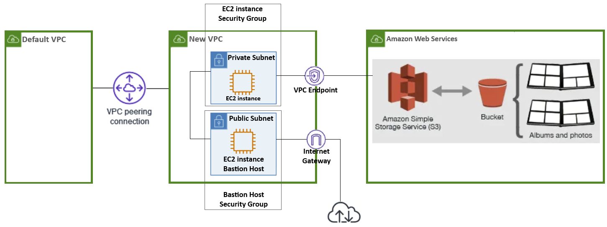

## Introduction:
The main steps in this guide are for establishing a **VPC Peering** and creating a **VPC endpoint** for **S3 Bucket Storage**. \
It includes other steps just for practice *or* as pre-requisites for the main steps. 

Each step has its own script in order to keep a well-organized folder structure for **modularity**, **easy debugging** and **maintainability**.

## AWS Architecture Diagram :
 <br/>

## Folders Structure:
```
aws-cli-VPCpeering-S3/
├── config/
|   ├── config.conf
|   └── temp.conf
└── scripts/
    ├── create_ec2.sh
    ├── create_ig.sh
    ├── create_s3.sh
    ├── create_sg.sh
    ├── create_subnets.sh
    ├── create_vpc_endpoint.sh
    ├── create_vpc_peering.sh
    ├── create_vpc.sh
    ├── destroy_all.sh
    ├── execute_all.sh
    └── main.sh
```

## Script Steps:
> Before running the main script:  ``` $ ./scripts/main.sh ``` , \
give permission to all files to execute:  ``` $ chmod +x scripts/execute_all.sh ```

> The *scripts/destoy_all.sh* is meant for deleting all that we created, with the help of a *.conf* file that stores all temporary variables (ID, ARN).

1. Create a new **VPC**:
    - Make sure *CIDR block* isn't overlapping with *default **VPC**'s CIDR block*.
    - Enable *DNS hostname* support (for **public subnet**).
2. Create an **Internet Gateway**:
    - Create an **Internet Gateway** (for **public subnet**) and attach it to the new **VPC**.
3. Create 2 **Subnets**:
    - Create a **public subnet** and a **private subnet**.
    - Create 2 **route tables**:
        - **Public subnet** → **Internet Gateway** (for internet access).
        - **Private subnet** → No direct internet access.
4. Establish **VPC Peering**:
    - Place your *default **VPC** ID* in your *config.conf* file: \
    ``` DEFAULT_VPC_ID="vpc-xxxxxxxx" ```
    - Create a **VPC peering** connection between the *default **VPC*** and the *new **VPC***.
    - Ensure the **VPC peering** connection status is *active*.
    - Update **route tables** of each **subnet** and default **VPC**.
5. Creating **Security Groups**:
    - Create a **Security Group** for public **EC2** that allows *SSH* from anywhere.
    - Create a **Security Group** for private **EC2** that allows *SSH* only from the public **EC2**.
6. Launch **EC2 Instances**:
    - Launch an **EC2 instance** in the **public subnet** (acting as a **bastion host**).
    - Launch another **EC2 instance** in the **private subnet** (no public IP).
    - Try to *SSH* from the public **EC2 instance** to the private **EC2 instance** using the *public IP* or *DNS*.
7. Create an **S3 Bucket**.
8. TODO: **VPC Endpoint** for **S3**:
    - Create a VPC endpoint for S3 in the private subnet.
    - Update the route tables for the private subnet to route S3 traffic through the VPC endpoint.
    > Don’t create a **nat gateway**, the **private subnet** should only reach **s3**.
9. TODO: Upload File to **S3**:
    - From the EC2 instance in the private subnet, use the AWS CLI to attempt to upload a file to the S3 bucket.
